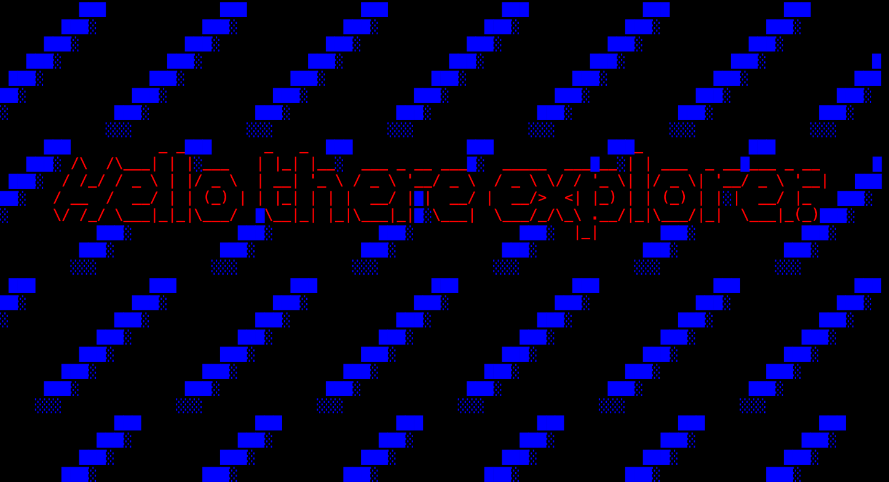

<div align="center">



<p>My name is Karl, I do product design and web development. On my journey, I've led design process for user-centric products and design systems.</p>
<br/>
<p>(Been designing for two <a href="https://www.lift99.co/walloffame" target="_blank">#EstonianMafia</a> startups.)</p>


<br/>

[](https://bizarrelabs.one)
[](https://linkedin.com/in/karlsimmer)
[](mailto:karlsimmer@gmail.com)

</div>

---

## What I do

```
Design Systems   →   Tokens, components, governance, documentation
Product Design   →   End-to-end UX from research to shipped product
Design × Eng     →   Figma-to-code automation, React, HTML, CSS
AI-augmented     →   Claude, Midjourney
```

## This week I spent my time on

<!--START_SECTION:waka-->
<!--END_SECTION:waka-->

---
